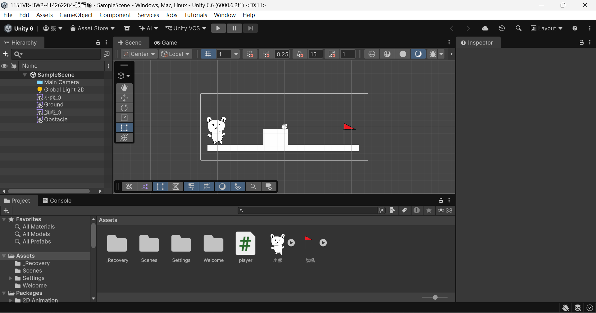

# 1151VR-HW2-414262284-張智瑜

## 專案截圖

## GitHub連結
https://github.com/cychang1688-sketch/1151VR-HW2-414262284-CCY.git

## YouTube連結
[https://youtu.be/nDjqnEs9wOA](https://youtu.be/7v99slvbJfY
)

## 製作流程及相關操作說明

本次作業使用 Unity 製作 2D 遊戲場景，匯入小熊角色圖片，並建立地板、障礙物及旗幟終點。角色加入 Rigidbody 2D 與 Box Collider 2D，使角色能正常移動及跳躍。操作方式為 A 鍵向左、D 鍵向右、Space 空白鍵跳躍。程式使用 Vector2 與陣列儲存角色左右移動方向，並利用 onGround 判斷是否可再次跳躍。當角色碰到 Tag 為 Finish 的旗幟時，角色會停止移動，Console 顯示「到達終點！」。

